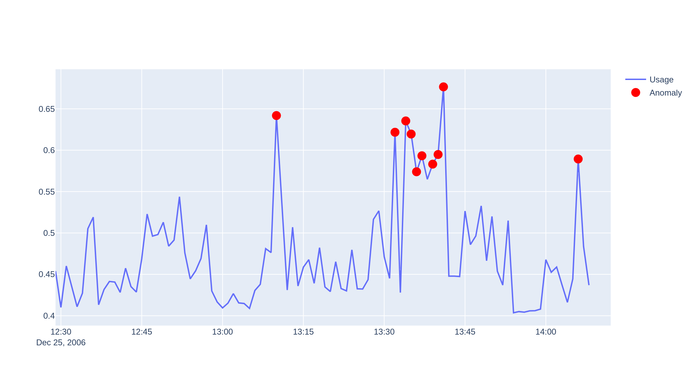

# Smart-Grid-Integration


Please checkout the official website of [NMEPSCoR Smart Grid](https://www.nmepscor.org/)
## Mission
The New Mexico SMART Grid Center mission is to investigate the fundamental challenges to transition 
the existing electricity transmission and distribution infrastructure into a SMART grid and develop 
supporting knowledge, national talent, and an informed public.

## Project
In this project, I worked under Dr. Huiping Cao and Dr. Tuan Le of New Mexico State University. My research area was mainly focused 
on ```decision support``` which involved integration of machine learning, data mining, knowledge-based, 
and other artificial intelligence techniques to utilize heterogeneous Distribution Feeder Microgrid and 
smart grid data to make computer-aided and automatic decisions.

## Multivariate Time Series Analysis
In this project, I worked on multivariate time series anomaly detection using ```spark-iforest```  for which I attempted to simulate a real-time plot which shows anomalous points in the data.<br><br>
The dataset I used for testing can be found in UCI Machine Learning Repository - [Individual household electric power consumption Data Set](https://archive.ics.uci.edu/ml/datasets/Individual+household+electric+power+consumption)

## Real-time Anomaly detection in action



## Future Work
<ul>
<li>
In the future, as new stations/sub-stations are installed, the size of the incoming data will 
increase and therefore we may need to consider having a system to preprocess the incoming 
data stream so that we don’t face a bottleneck situation.
</li>
<li>
Apache Spark currently runs in a standalone mode and cannot handle bulk of incoming data
efficiently. So, in the future, we may need to work on running Apache Spark in a distributed 
mode to handle this situation effectively.
</li>
<li>
Apache Spark is powerful framework which supports streaming data analysis. The current design 
performs analysis by running the algorithm in intervals. We can modify this to make it more 
efficient.
</li>
<li>
We can always try and implement more machine learning approaches for analyzing the time 
series data.
</li>
<br><br>
<p align="center">I would like to thank my advisors for giving me a chance to work on this project and to and my team 
members for helping and supporting me</p>
